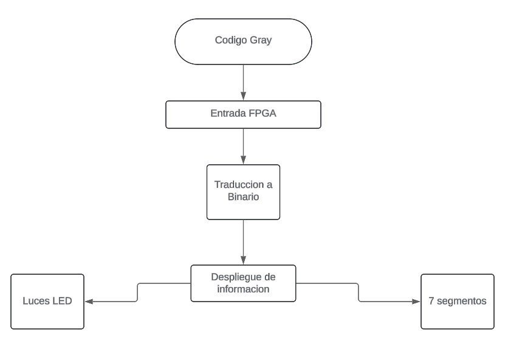
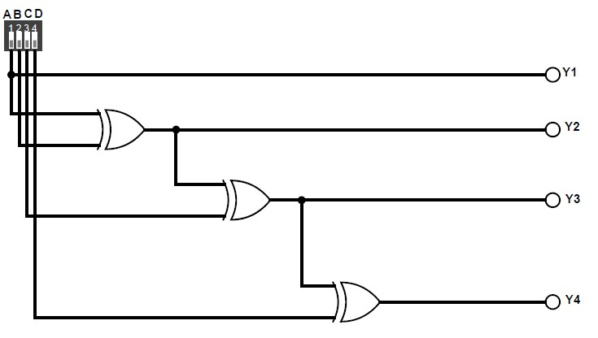
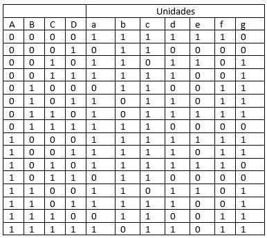
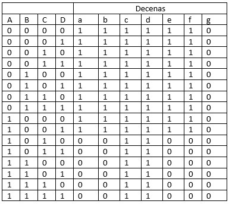
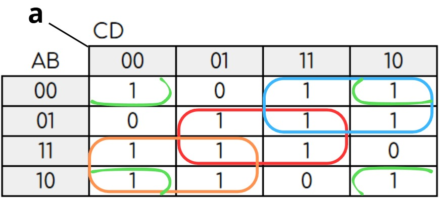

# Tarea 1: Introducción a diseño digital en HDL

## 1. Abreviaturas y definiciones
- **FPGA**: Field Programmable Gate Arrays
- **MSB**: Bit más significativo
- **!**: Operador NOT
- **+**: Operador OR
- **^**: Operador XOR

## 2. Referencias
[0] David Harris y Sarah Harris. *Digital Design and Computer Architecture. RISC-V Edition.* Morgan Kaufmann, 2022. ISBN: 978-0-12-820064-3

## 3. Desarrollo

### 3.0 Descripción general del sistema
El sistema por utilizar es un circuito digital diseñado para capturar un código Gray, convertirlo a un formato binario, y mostrar el resultado tanto en luces LED como en un display de 7 segmentos. La implementación se realiza utilizando una FPGA, que permite la programación del comportamiento que se requiere. El proceso se divide en varios subsistemas que se conectan para lograr la funcionalidad deseada. 

Como primero se tiene el subsistema de lectura y decodificación de código Gray. El código Gray es un tipo de código binario en el cual dos valores consecutivos difieren en un solo bit. Este va ser el punto de partida donde se introduce el código Gray mediante interruptores y este va hacia la FPGA, donde se capturan los valores del código de Gray. 

Luego se conecta con el subsistema de despliegue de código ingresado traducido a formato binario en luces LED. Este bloque dentro de la FPGA convierte el código Gray capturado en un código binario. Se utilizan operaciones lógicas, específicamente compuertas XOR, para realizar esta conversión. Ya cuando se obtiene la conversión, puede seguir al siguiente subsistema.

Por último, se tiene el subsistema de despliegue de código ingresado y decodificado en display de 7 segmentos. Donde se maneja el despliegue del código binario resultante hacia los dispositivos de salida: luces LED y el display de 7 segmentos. Dando una representación visual del código introducido. 


 
Diagrama de bloques del sitema general.

### 3.1 Módulo 1 (Conversión Código Gray a Código Binario)

#### 1. Encabezado del módulo
```SystemVerilog
module moduleGray (
    input logic [3:0] codigo_gray_pi,
    output logic [3:0] cod_bin
);
```
#### 2. Parámetros
- Este módulo no cuenta con parámetros.

#### 3. Entradas y salidas:
- `codigo_gray_pi`: Entrada de 4 bits para recibir el código Gray ejecutado de manera externa.
- `cod_bin`: Salida de 4 bits con valor binario del código Gray ingresado.

#### 4. Criterios de diseño
Basándose de la conversión de código Gray a código binario se buscó una forma de representarlo en ecuaciones lógicas. Para convertir un número en código Gray a código binario, primero, se mantiene el MSB, y luego, se toma este valor y se suma al siguiente bit, si la suma da como resultado 10'b, se descarta el acarreo, y a partir de este punto puede ser visto como una operación XOR entre el resultado y el siguiente bit. Las ecuaciones lógicas para este módulo fueron las siguientes:

 $\` Y_1 = A ; Y_2 = A \oplus B ; Y_3 = A\oplus B\oplus C; Y_4= A\oplus B\oplus C\oplus D \`$. 

La representacion de la ecuacion anterior en el diagrama es la siguiente: 




#### 5. Testbench
Para el testbench de este módulo se demostró que la conversión funcionara de acuerdo con la tabla de verdad realizada para todo valor de la misma visualizando el resultado la consola de comandos. Cada dato ingresado lanzó el resultado correcto.
(resultados)

### 3.2 Módulo 2 (Código Binario en LEDs)
#### 1. Encabezado del módulo
```SystemVerilog
module moduleLED(
    input logic [3:0] cod_bin,
    output logic [3:0] codigo_bin_led_po  
);
```
#### 2. Parámetros
- Este módulo no cuenta con parámetros.

#### 3. Entradas y salidas:
- `cod_bin`: Entrada que toma la salida del módulo de conversión.
- `codigo_bin_led_po`: Salida que transporta el estado de los LEDs.

#### 4. Criterios de diseño
Se planteó que los bits obtenidos en el módulo 3.1, atravesara cada uno un multiplexor donde el valor del bit es el que selecciona la condición del LED, si es verdadero se enciende, y se falso se apaga. La ecuación lógica para este módulo se puede representar como una compuerta AND, con N = [1:0]: L = YN

#### 5. Testbench
Al igual que el módulo anterior, el testbench probó que la tabla de equivalencias de código gray con código binario se cumpliera sin problemas y los mostraba en la consola de comandos, con el valor 1 representando cuando el LED está encendido y el valor 0 cuando está apagado.

### 3.3 Módulo 3 (Código Decimal en 7 Segmentos)
#### 1. Encabezado del módulo
```SystemVerilog
module module7SEG(
    input logic rst_pi,
    input logic [3:0] cod_bin,
    output logic [1:0] anodo_po,
    output logic [6:0] catodo_po
);
```
#### 2. Parámetros
- Este módulo no cuenta con parámetros.

#### 3. Entradas y salidas:
- `rst_pi`: Entrada que toma el valor verdadero o falso del botón en la FPGA.
- `cod_bin`: Entrada que toma la salida del módulo de conversión
- `anodo_po`: Salida que determina que 7-segmentos enciende
- `catodo_po`: Salida que tiene el valor de los estados para cada LED de los 7-segmentos

#### 4. Criterios de diseño
Para cada LED del 7-segmentos se realizó una tabla de verdad que determina que cuando se encienden y cuando se apagan, tanto para el 7-segmentos que representa las unidades como el que representa las decenas. Además, se utililzó un multiplexor que sirviera como selector del 7-segmentos que enciende cuando se presiona el botón.
Las ecuaciones lógicas para este módulo fueron las siguientes:
* Primero se declararon:
- b1 = Y[3]
- b2 = Y[2]
- b3 = Y[1]
- b4 = Y[0]

* 7-segmentos de Unidades:
- seg_a = !b2!b4 +b1!b3 + !b1b3 + b2b4
- seg_b = !b3!b4 + b1!b3 +b1!b4 + !b2 + !b1b3b4
- seg_c = b1!b2 + b2b3 + !b1!b3 + b4
- seg_d = b1!b3 + !b2!b4 + b1b2b3 + !b1!b2b3 + b2!b3b4 + !b1b3!b4
- seg_e = b1!b3!b4 + !b1b3!b4 + !b2!b4
- seg_f = !b1!b3!b4 + b2b3!b4 + b2 + b1!b2!b4 + !b2!b3!b4
- seg_g = b2!b3 + b1b2 + b1!b3 + !b1b3!b4 + !b1!b2b3

* 7-segmentos de Decenas:
- Para los segmentos a, d, e, f: sd_X = !b1 + !b2!b3
- Para los segmentos b,c: sd_Y = 1
- Para el segmento g: sd_Z = 0

* Multiplexor del botón:
- S = X^Y
- Activándose únicamente cuando es verdadero.
Para cada LED del 7-segmentos se realizó una tabla de verdad que determina que cuando se encienden y cuando se apagan, tanto para el 7-segmentos que representa las unidades como el que representa las decenas. 
(diagrama)

#### 5. Simplificación de ecuaciones booleanas
Para la simplicación de las ecuaciones booleanas usadas para el 7 segmentos se obtuvieron las siguientes tablas de verdad:





Se procedio a la simplificacion de la ecuacion booleana, por medio de la utilizacion de mapas de Karnaugh. Se muestra el siguiente ejemplo del segmento a, donde se pudo simplificar al maximo y resulto la siguiente ecuacion booleana. 

$\` a = BD + \overline{A}C + A\overline{C}+\overline{BD} \`$ 


Ejemplo de mapa de Karnaugh para el segmento a.

#### 6. Testbench
Para la prueba en el testbench, se decidió probar que mostrara el resultado decimal correcto, que cada segmento encendiera al valor correcto y simulaciones de presionar el botón para comprobar el cambio del 7-segmento de unidades a decenas y viceversa.

## 4. Ejemplo de simulacion funcional del sistema completo.

## 5. Consumo de recursos
Al realizar el análisis de consumo de recursos, se obtuvieron los siguientes datos: 

```SystemVerilog
=== TopModule ===

   Number of wires:                 26
   Number of wire bits:             61
   Number of public wires:          26
   Number of public wire bits:      61
   Number of memories:               0
   Number of memory bits:            0
   Number of processes:              0
   Number of cells:                 25
     GND                             1
     IBUF                            5
     LUT1                            1
     LUT4                            3
     MUX2_LUT5                       1
     OBUF                           13
     VCC                             1

```
Con base a los datos obtenidos se utiliza un numero de Wires de 26 y Wire Bits 61, al ser estos los que se encargan de las conexiones internas que llevan señales entre los diferentes componentes del diseño. Cada wire bit es una línea de señal específica dentro del circuito, y 61 bits indican un nivel moderado de interconexiones, reflejando la complejidad relativa del sistema que maneja múltiples entradas y salidas.

Con respecto al número de celdas (25), al ser cada celda un componente lógico o funcional dentro de la FPGA, como compuertas lógicas, buffers, y otros bloques necesarios para la operación del circuito. Con 25 celdas, el diseño mantiene un uso eficiente de recursos.
La cantidad de celdas y conexiones está justificada por la necesidad de manejar múltiples entradas y salidas, asegurando que el sistema funcione correctamente y de manera eficiente. El uso de recursos refleja la complejidad del diseño, para cumplir con el objetivo de la conversión de datos y la visualización de resultados. 

Además, acerca a la utilización de recursos del dispositivo, se obtuvieron los siguientes datos:

```SystemVerilog
Info: Device utilisation:
Info: 	                 VCC:     1/    1   100%
Info: 	               SLICE:     3/ 8640     0%
Info: 	                 IOB:     8/  274     2%
Info: 	                ODDR:     0/  274     0%
Info: 	           MUX2_LUT5:     0/ 4320     0%
Info: 	           MUX2_LUT6:     0/ 2160     0%
Info: 	           MUX2_LUT7:     0/ 1080     0%
Info: 	           MUX2_LUT8:     0/ 1056     0%
Info: 	                 GND:     1/    1   100%
Info: 	                RAMW:     0/  270     0%
Info: 	                 GSR:     1/    1   100%
Info: 	                 OSC:     0/    1     0%
Info: 	                rPLL:     0/    2     0%
```
Con lo que se puede analizar que el diseño es eficiente y no requiere gran parte de los bloques complejos de la FPGA, lo cual es positivo para un sistema de baja complejidad como este. Además, las funciones lógicas y de interfase son implementadas de manera efectiva, sin recurrir a recursos adicionales innecesarios.

Los datos también muestran como el diseño utiliza de manera adecuada los recursos disponibles, especializándose solo en lo que es necesario para realizar las funciones básicas del sistema y dejando disponibles recursos adicionales para futuras expansiones o mejoras. Esto refleja un diseño bien balanceado y optimizado para la tarea asignada.

## 6. Problemas encontrados durante el proyecto
1. Cuando se declara un commutador, si el nombre es únicamente una letra mayúscula o un número, el programa no toma como tal. Para solucionarlo se decidió utilzar letras minúsculas y enumerarlas si fuera el caso.
2. Al declarar las "constrains", se debe colocar el valor de tensión en los pines, debido a que si uno de estos lo atraviesan tensiones diferentes el código no podrá ser colocado en el FPGA.
3. En el modulo de 7 segmentos al agregar la ecuacion booleana al segmento f, estaba dando un valor no esperado, por lo que se tuvo que volver a evaluar este segmento para obtener el resultado deseado.

## Apendices:
### Apendice 1:
Tablas de verdad, diagramas de bloques,
