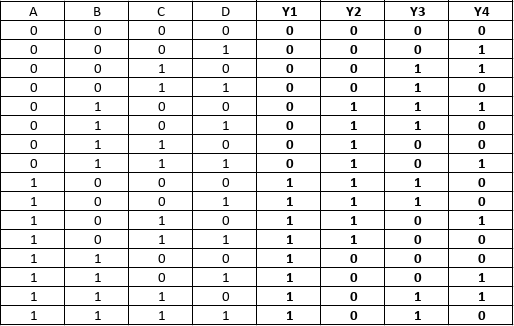
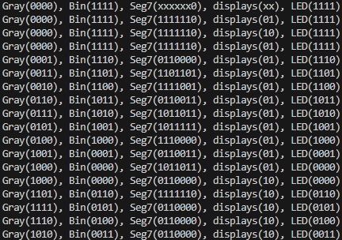

# Tarea 1: Introducción a diseño digital en HDL

## 1. Introducción
Un sistema combinacional es un sistema lógico donde sus salidas son únicamente función de sus entradas en un momento dado y no guardan estados  anteriores. Para este proyecto se busca implementar un sistema combinacional que decodifique un código Gray brindado y que por medio de este realice funciones como cambiar estados de luces LED y brindar valores a displays 7 segmentos, utilizando exclusivamente álgebra booleana para expresar estos comportamientos en ecuaciones.

## 2. Objetivos
- Elaborar un subsistema de lectura y decodififcación de código Gray.
- Implementar un subsistema de traducción de código Gray a código binario que se despliegue en luces LED.
- Diseñar un subsistema que decodifique el código Gray ingresado en un display de 7 segmentos en formato decimal.

## 3. Propuesta de Solución
### 3.1. Abreviaturas y definiciones
- **FPGA**: Field Programmable Gate Arrays
- **MSB**: Bit más significativo
- **!**: Operador NOT
- **+**: Operador OR
- **^**: Operador XOR

### 3.2. Descripción general del sistema
El sistema utilizado fue un circuito digital diseñado para capturar un código Gray, convertirlo a un formato binario, y mostrar el resultado tanto en luces LED como en un display de 7 segmentos. La implementación se realizó utilizando una FPGA, que permite la programación del comportamiento que se requiere. El proceso se dividió en varios subsistemas que se conectan para lograr la funcionalidad deseada. 

En primer lugar se encuentra el subsistema de lectura y decodificación de código Gray. El código Gray es un tipo de código binario en el cual dos valores consecutivos difieren en un solo bit. Este fue el punto de partida, donde se introduce el código Gray mediante interruptores y este entra hacia la FPGA por medio de sus pines, donde se capturan los valores. El subsistema lee los pines de entrada con el código Gray, los traduce a código binario y los prepara para la siguiente etapa.  Se utilizaron operaciones lógicas, específicamente compuertas XOR, para realizar esta conversión. 

Luego, el valor traducido atraviesa el módulo de luces LED, donde los pines de salida, con el valor binario, determinan si las luces encienden o se mantienen apagadas. Por último, se tiene el subsistema de despliegue de código ingresado y decodificado en display de 7 segmentos. Donde se maneja el despliegue del código binario resultante hacia los dispositivos de salida: luces LED y el display de 7 segmentos. Dando una representación visual del código introducido en formato decimal. 

 

Figura 1. Diagrama de bloques del sistema general.

### 3.3. Módulo 1 (Módulo Top)

#### 1. Encabezado del módulo
```SystemVerilog
module moduleGray (
    input logic [3:0] codigo_gray_pi,
    input logic rst_pi,
    output logic [3:0] codigo_bin_led_po,
    output logic [1:0] anodo_po,
    output logic [6:0] catodo_po
);
```
#### 2. Parámetros
- Este módulo no cuenta con parámetros.

#### 3. Entradas y salidas:
- `codigo_gray_pi`: Entrada que toma los valores del código Gray. 
- `rst_pi`: Entrada que toma el valor verdadero o falso del botón en la FPGA.
- `codigo_bin_led_po`: Salida que transporta el estado de los LEDs.
- `anodo_po`: Salida que determina que 7-segmentos enciende.
- `catodo_po`: Salida que tiene el valor de los estados para cada LED de los 7-segmentos.

#### 4. Criterios de diseño
Módulo principal donde se declararon todos los pines a utilizar en el diseño, y donde se colocaron los módulos desarrollados para el proyecto

#### 5. Testbench
El testbench se enfocó a que se mostrara el valor en bits de cada proceso del diseño, donde se decidió enseñar el valor del código Gray ingresado, el valor binario traducido, el valor en bits de las luces LED, el valor de los displays 7 segmentos y el estado del botón que cambie el display encendido.

### 3.4. Módulo 2 (Código Binario en LEDs)
#### 1. Encabezado del módulo
```SystemVerilog
module moduleLED(
    input logic [3:0] codigo_gray_pi,
    output logic [3:0] codigo_bin_led_po  
);
```
#### 2. Parámetros
- Este módulo no cuenta con parámetros.

#### 3. Entradas y salidas:
- `codigo_gray_pi`: Entrada que toma los valores del código Gray.
- `codigo_bin_led_po`: Salida que transporta el estado de los LEDs.

#### 4. Criterios de diseño
Basándose de la conversión de código Gray a código binario se buscó una forma de representarlo en ecuaciones lógicas. Para convertir un número en código Gray a código binario, primero, se mantiene el MSB, y luego, se toma este valor y se suma al siguiente bit, si la suma da como resultado 10'b, se descarta el acarreo, y a partir de este punto puede ser visto como una operación XOR entre el resultado y el siguiente bit. Las ecuaciones lógicas para este módulo fueron las siguientes:

 $\` Y_1 = A ; Y_2 = A \oplus B ; Y_3 = A\oplus B\oplus C; Y_4= A\oplus B\oplus C\oplus D \`$. 

La tabla de verdad de la ecuación anterior fue la siguiente:


Figura 2. Tabla de verdad de traducción código gray a binario.

La representación de la ecuación anterior en el diagrama es la siguiente: 


Figura 3. Diagrama de bloques de traducción de código Gray a código binario.

Se planteó que se realizara la conversión de código Gray a código binario en el propio módulo, y que cada bit de este valor atravesara un multiplexor donde el valor del bit es el que selecciona la condición del LED, si es verdadero se enciende, y se falso se apaga. La ecuación lógica para este módulo se puede representar como una compuerta AND, con N = [1:0]: L = YN

#### 5. Testbench
El testbench probó que la tabla de equivalencias de código gray con código binario se cumpliera sin problemas y los mostraba en la consola de comandos, con el valor 0 representando cuando el LED está encendido y el valor 1 cuando está apagado, debido a que la salida de la FPGA actúa de forma inversa.

### 3.5. Módulo 3 (Código Decimal en 7 Segmentos)
#### 1. Encabezado del módulo
```SystemVerilog
module module7SEG(
    input logic [3:0] codigo_gray_pi,
    input logic rst_pi,
    output logic [1:0] anodo_po,
    output logic [6:0] catodo_po
);
```
#### 2. Parámetros
- Este módulo no cuenta con parámetros.

#### 3. Entradas y salidas:
- `codigo_gray_pi`: Entrada que toma los valores del código Gray. 
- `rst_pi`: Entrada que toma el valor verdadero o falso del botón en la FPGA.
- `anodo_po`: Salida que determina que 7-segmentos enciende.
- `catodo_po`: Salida que tiene el valor de los estados para cada LED de los 7-segmentos.

#### 4. Criterios de diseño
Se utilizó el  mismo proceso que el módulo anterior para realizar el proceso de traducción de código Gray a código binario. Para cada LED del 7-segmentos se realizó una tabla de verdad que determina que cuando se encienden y cuando se apagan, tanto para el 7-segmentos que representa las unidades como el que representa las decenas. Además, se utililzó un multiplexor que sirviera como selector del 7-segmentos que enciende cuando se presiona el botón.
Las ecuaciones lógicas para este módulo fueron las siguientes:
* Primero se declararon:
- b1 = Y[3]
- b2 = Y[2]
- b3 = Y[1]
- b4 = Y[0]

* 7-segmentos de Unidades:
- seg_a = !b2!b4 +b1!b3 + !b1b3 + b2b4
- seg_b = !b3!b4 + b1!b3 +b1!b4 + !b2 + !b1b3b4
- seg_c = b1!b2 + b2b3 + !b1!b3 + b4
- seg_d = b1!b3 + !b2!b4 + b1b2b3 + !b1!b2b3 + b2!b3b4 + !b1b3!b4
- seg_e = b1!b3!b4 + !b1b3!b4 + !b2!b4
- seg_f = !b1!b3!b4 + b2b3!b4 + b2 + b1!b2!b4 + !b2!b3!b4
- seg_g = b2!b3 + b1b2 + b1!b3 + !b1b3!b4 + !b1!b2b3

* 7-segmentos de Decenas:
- Para los segmentos a, d, e, f: sd_X = !b1 + !b2!b3
- Para los segmentos b,c: sd_Y = 1
- Para el segmento g: sd_Z = 0

* Multiplexor del botón:
- S = X^Y
- Activándose únicamente cuando es verdadero.
Para cada LED del 7-segmentos se realizó una tabla de verdad que determina que cuando se encienden y cuando se apagan, tanto para el 7-segmentos que representa las unidades como el que representa las decenas. 
(diagrama)

#### 5. Simplificación de ecuaciones booleanas
Para la simplicación de las ecuaciones booleanas usadas para el 7 segmentos se obtuvieron las siguientes tablas de verdad:


Figura X. Tabla de verdad de display 7 segmentos que representa las unidades.


Figura X. Tabla de verdad de display 7 segmentos que representa las decenas.

Se procedió a la simplificación de la ecuación booleana, por medio de la utilización de mapas de Karnaugh. Se muestra el siguiente ejemplo del segmento a en el display de unidades, donde se pudo simplificar al máximo y resultó la siguiente ecuación booleana. 

$\` a = BD + \overline{A}C + A\overline{C}+\overline{BD} \`$ 


Figura X. Ejemplo de mapa de Karnaugh para el segmento a en el display de unidades.

#### 6. Testbench
Para la prueba en el testbench, se decidió probar que mostrara el resultado decimal correcto, que cada segmento encendiera al valor correcto y simulaciones de presionar el botón para comprobar el cambio del 7-segmento de unidades a decenas y viceversa.

## 4. Ejemplo de simulación funcional del sistema completo.
En la Figura X, se muestran los valores los valores del 0 al 15 (valor decimal), representados en cada proceso que atravesaron por los módulos, mostrando en pantalla los resultados de su valor en código Gray, su valor en código binario y el valor binario de los LEDs negados debido a que la salida del FPGA invierte el valor, el valor binario de los displays 7 segmentos, y el valor binario del botón que cambia el display encendido.



Figura X. Simulación del testbench.

## 5. Análisis de Resultados
### 5.1 Consumo de recursos
Al realizar el análisis de consumo de recursos, se obtuvieron los siguientes datos: 

```SystemVerilog
=== TopModule ===

   Number of wires:                 31
   Number of wire bits:             63
   Number of public wires:          31
   Number of public wire bits:      63
   Number of memories:               0
   Number of memory bits:            0
   Number of processes:              0
   Number of cells:                 45
     GND                             1
     IBUF                            5
     LUT1                            3
     LUT2                            1
     LUT3                            5
     LUT4                           10
     MUX2_LUT5                       7
     OBUF                           13

```
Con base a los datos obtenidos se utilizaron un número de Wires de 31 y Wire Bits 63, al ser estos los que se encargan de las conexiones internas que llevan señales entre los diferentes componentes del diseño. Cada wire bit es una línea de señal específica dentro del circuito, y 61 bits indican un nivel moderado de interconexiones, reflejando la complejidad relativa del sistema que maneja múltiples entradas y salidas.

Con respecto al número de celdas (45), al ser cada celda un componente lógico o funcional dentro de la FPGA, como compuertas lógicas, buffers, y otros bloques necesarios para la operación del circuito. Con 45 celdas, el diseño mantiene un uso relativamente eficiente de recursos.
La cantidad de celdas y conexiones está justificada por la necesidad de manejar múltiples entradas y salidas, asegurando que el sistema funcione correctamente y de manera eficiente. El uso de recursos refleja la complejidad del diseño, para cumplir con el objetivo de la conversión de datos y la visualización de resultados. 

Además, acerca a la utilización de recursos del dispositivo, se obtuvieron los siguientes datos:

```SystemVerilog
Info: Device utilisation:
Info: 	                 VCC:     1/    1   100%
Info: 	               SLICE:    19/ 8640     0%
Info: 	                 IOB:    18/  274     6%
Info: 	                ODDR:     0/  274     0%
Info: 	           MUX2_LUT5:     7/ 4320     0%
Info: 	           MUX2_LUT6:     0/ 2160     0%
Info: 	           MUX2_LUT7:     0/ 1080     0%
Info: 	           MUX2_LUT8:     0/ 1056     0%
Info: 	                 GND:     1/    1   100%
Info: 	                RAMW:     0/  270     0%
Info: 	                 GSR:     1/    1   100%
Info: 	                 OSC:     0/    1     0%
Info: 	                rPLL:     0/    2     0%
```
Con lo que se puede analizar que el diseño es eficiente y no requiere gran parte de los bloques complejos de la FPGA, lo cual es positivo para un sistema de baja complejidad como este. Además, las funciones lógicas y de interfase son implementadas de manera efectiva, sin recurrir a recursos adicionales innecesarios.

Los datos también muestran como el diseño utiliza de manera adecuada los recursos disponibles, especializándose solo en lo que es necesario para realizar las funciones básicas del sistema y dejando disponibles recursos adicionales para futuras expansiones o mejoras. Esto refleja un diseño bien balanceado y optimizado para la tarea asignada.

### 5.2. Prueba del prototipo.
En las pruebas realizadas en la protoboard, se logró que tanto la parte del circuito de introducción del código Gray como las luces LED del FPGA funcionara de la  manera esperaba, pero los display 7 segmentos, tuvieron un par problemas, los cuales fueron que encendieran al  mismo tiempo o que encendían los LEDs correctos del número indicado, pero los LEDs estaban divididos entre ambos displays. Estos problemas fueron debido a que las conexiones de los displays se realizaron de manera incorrectas porque estos eran 7 segmentos de cátodo común y no se comprobó ese detalle a la hora de realizar el prototipo.

## 6. Conclusiones
Se logró demostrar que la  decodificación de código Gray a código binario actúa como una operación XOR entre las salidas comenzando con el MSB de la entrada.
Debido a que se necesitan pines físicos declarados en el archivo de "constrains", se optó por incluir la función de decodificación del código Gray a los módulos de control de estado de las luces LED y el módulo enfocado en los displays 7 segmentos, para reducir el número de pines que se podrían haber utilizado.
El valor binario decodificado se niega su valor salida en el módulo de LEDs debido a que la FPGA trabaja las salidas de manera inversa y así lograr que las luces encienda con un 1 en la entrada del módulo y se apaguen con un 0.
Se logró que un botón de la FPGA cambiara el display 7 segmentos que enciende, pero el cambio permanece únicamente cuando se mantiene presionado el botón, cuando este se suelta regresa al valor original.
Se realizó una ecuación booleana para segmento de los diplays y las ecuaciones resultantes fueron simplificadas por medio de mapas de Karnaugh.

## 7. Problemas encontrados durante el proyecto
1. Cuando se declara un commutador, si el nombre es únicamente una letra mayúscula o un número, el programa no toma como tal. Para solucionarlo se decidió utilzar letras minúsculas y enumerarlas si fuera el caso.
2. Al declarar las "constrains", se debe colocar el valor de tensión en los pines, debido a que si uno de estos lo atraviesan tensiones diferentes el código no podrá ser colocado en el FPGA.
3. En el módulo de 7 segmentos al agregar la ecuación booleana al segmento f, dió un valor no esperado, por lo que se tuvo que volver a evaluar este segmento para obtener el resultado deseado.
4. Las entradas y salidas de cada módulo son únicamente pines declarados en las constrains del proyecto. Si se necesitan más, se declaran en el archivo .cst, y lo mejor es eliminar todo pin que no se utilice del mismo archivo.
5. Los displays 7 segmentos utilizados fueron de cátodo común, lo cual provocó confusión a la hora de realizar el circuito de prueba.

## Apendices:
### Apendice 1:
Tablas de verdad, diagramas de bloques,
